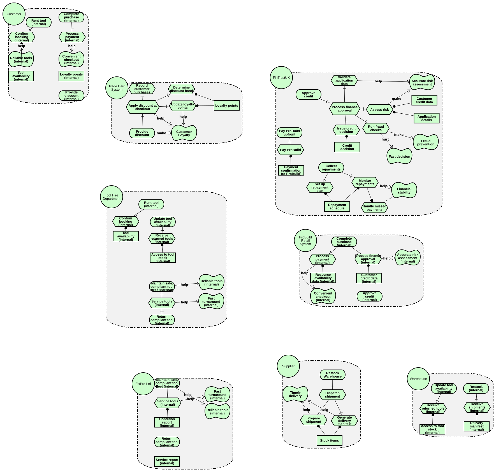
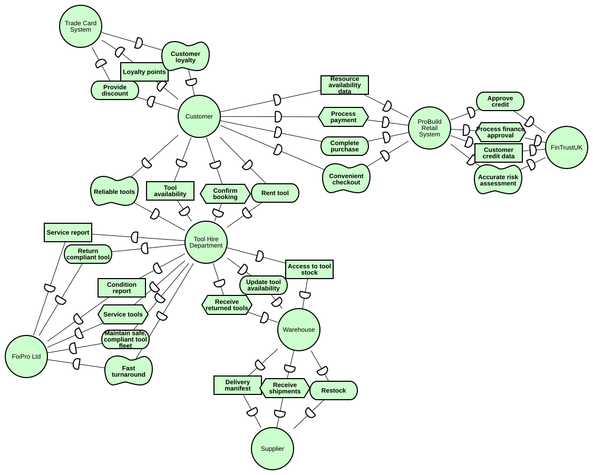

# ProBuild Supplies Ltd — Process Automation

**Module:** UFCFAF-30-3 Development of Information Systems Project — UWE Bristol 2025-26
**Group:** 2

Process automation system for ProBuild Supplies Ltd. Built on Camunda 8 (self-managed) with Java Spring Boot workers, the system automates the full customer lifecycle across five pools: customer website, ProBuild operations, FinTrust finance, FixPro maintenance, and warehouse/supplier management.

---

## System Architecture

```
┌─────────────────────────────────────────────────────────────┐
│                    Camunda 8.9.0 (self-managed)              │
│                                                              │
│  ┌──────────┐  ┌──────────┐  ┌──────────┐  ┌───────────┐  │
│  │ Customer │  │ ProBuild │  │  FixPro  │  │ FinTrust  │  │
│  │  Pool    │→→│   Pool   │→→│   Pool   │  │   Pool    │  │
│  │          │  │  (Pro)   │  │ (0c6d9wt)│  │ (1kwzimz) │  │
│  └──────────┘  └──────────┘  └──────────┘  └───────────┘  │
│                      ↕ Zeebe gRPC :26500                     │
└──────────────────────────────────────────────────────────────┘
                           ↕
┌─────────────────────────────────────────────────────────────┐
│              Spring Boot Worker Application                  │
│  FoundationWorkers  │  ProBuildWorkers  │  InventoryWorkers  │
│       ToolRentalWorkers  │  FinTrustWorkers               │
│                 51 @JobWorker methods total                   │
└─────────────────────────────────────────────────────────────┘
```

**Simulated external partners (no real API calls — rule-based stubs):**

| Partner | Simulated by | Role |
|---|---|---|
| FinTrust UK | `FinTrustWorkers.java` | Finance installment plan processing (5% interest, 6 or 12 months) |
| FixPro Ltd | `ToolRentalWorkers.java` + `InventoryWorkers.java` | Tool maintenance and return cycle |
| IMS-POS | `InventoryWorkers.java` | Inventory management system — stock sync |

---

## BPMN Processes

| Pool | Process ID | Executable | Workers |
|---|---|---|---|
| ProBuild (main) | `Pro` | Yes | FoundationWorkers, ProBuildWorkers, InventoryWorkers, ToolRentalWorkers |
| FixPro lts | `Process_0c6d9wt` | Yes | ToolRentalWorkers, InventoryWorkers |
| Customer | `Process_1hz3vp5` | Yes | (form-driven user tasks only) |
| FinTrust | `Process_1kwzimz` | Yes | FinTrustWorkers |
| Suppliers | `Process_1acsl6p` | No | InventoryWorkers (ready, pending) |

---

## Quick Start

### Prerequisites

| Requirement | Version |
|---|---|
| Java |21+ |
| Maven | 3.8+ |
| Docker Desktop | Latest |
| Camunda 8 | 8.9.0 self-managed (Docker Compose) |

### Worker stubs: [camunda-worker-foundation](camunda-worker-foundation)

### Run Camunda 8 locally (Docker Compose)

Reference: Camunda docs for Docker Compose local setup:  
https://docs.camunda.io/docs/self-managed/setup/deploy/local/docker-compose/

1. Start Camunda 8 via Docker Compose: `docker compose up -d`
2. Services available once running:

   | Service | URL |
   |---|---|
   | REST API | `http://localhost:8080` |
   | Operate | `http://localhost:8081` |
   | Tasklist | `http://localhost:8082` |
   | Zeebe gRPC | `localhost:26500` |

3. Open `operational BPMN V2.bpmn` in Camunda Modeler and click **Deploy** to the local cluster.
4. Start the Java workers:
   ```bash
   cd camunda-worker-foundation
   mvn spring-boot:run
   ```
   On startup, the log confirms all 51 workers are subscribed: `Started WorkerApplication in ~2 seconds`

5. Trigger process instances via the REST API (Pro process is message-driven — no plain start event):
   ```bash
   curl -X POST http://localhost:8080/v2/messages/publication \
     -H "Content-Type: application/json" \
     -d '{"name":"financeRequest","correlationKey":"","timeToLive":30000,"variables":{"orderTotal":1200.0,"financeInstallments":6,"customerId":"CUST-001","financeRequestId":"FIN-001","customerEmail":"customer@example.com"}}'
   ```

See [docs/camunda8-testing-outline.md](docs/camunda8-testing-outline.md) for all five tested paths with exact payloads and results.

---

## Project Structure

```
Group-2-Disp/
├── operational BPMN V2.bpmn        ← Canonical BPMN
├── ProBuild strategic.bpmn            ← AS-IS strategic BPMN model
├── forms/                             ← 18 Camunda 8 forms (.form JSON)
│   ├── Website.form                   ← Customer hire/purchase/membership portal
│   ├── audit.form                     ← Dual-mode warehouse audit (daily/weekly)
│   ├── damageReport.form              ← Tool damage incident report (dual signoff)
│   ├── PATTest.form                   ← Portable appliance test record
│   ├── serviceReport.form             ← Technician service completion form
│   ├── serviceLabel.form              ← Service label with repeatable parts section
│   ├── handoverForm.form              ← ProBuild ↔ FixPro tool handover (dual signoff)
│   ├── barcode.form                   ← Delivery receipt display (read-only)
│   ├── decom.form                     ← Asset decommissioning with justification
│   ├── discremicyReport.form          ← Inventory discrepancy report
│   ├── stockLevel.form                ← IMS stock level display
│   ├── toolInspection.form            ← Tool return inspection
│   ├── in-person hiring.form          ← Counter-staff assisted hire request
│   ├── in-person Queue.form           ← In-store queue registration
│   ├── qualityInpect.form             ← Quality inspection checklist (pass/fail gateway)
│   ├── toolRepairs.form               ← Tool repair/maintenance/dispose request
│   ├── read the service report.form   ← Service report review with replacement decision
│   └── detect for discrepency.form   ← Inventory discrepancy detection report
├── camunda-worker-foundation/
│   └── src/main/java/au/edu/group2/disp/workers/
│       ├── WorkerApplication.java     ← Spring Boot entry point
│       ├── FoundationWorkers.java     ← processOrder, financeRequest, payBill (3 workers)
│       ├── ProBuildWorkers.java       ← membership, queue, payment, order dispatch (22 workers)
│       ├── ToolRentalWorkers.java     ← rental lifecycle, damage, FixPro dispatch (8 workers)
│       ├── InventoryWorkers.java      ← IMS updates, delivery, stock (13 workers)
│       └── FinTrustWorkers.java       ← installment plans, finance emails (5 workers)
└── docs/
    ├── service-task-traceability.md   ← All 51 worker types mapped to BPMN elements
    ├── camunda8-testing-outline.md    ← Full test results: 5 test cases, 5 defects resolved
    ├── forms-ux-rationale.md          ← UX design rationale for all 18 forms
    └── camunda-github-sync-playbook.md ← Git workflow and deployment conventions
```

---

## Documentation

| Document | Purpose |
|---|---|
| [docs/service-task-traceability.md](docs/service-task-traceability.md) | Maps every BPMN `zeebe:taskDefinition` type to its Java worker, with inputs, outputs, and status |
| [docs/camunda8-testing-outline.md](docs/camunda8-testing-outline.md) | Full test strategy, 5 happy-path results, defect log (5 found and resolved) |
| [docs/forms-ux-rationale.md](docs/forms-ux-rationale.md) | UX design rationale and variable contracts for all 18 forms |
| [docs/camunda-github-sync-playbook.md](docs/camunda-github-sync-playbook.md) | Git branching strategy, deployment policy, anti-drift checklist |

---

## Git Workflow

Active branch: `feat/service-task-foundation` → merges to `main` on release.
Commit conventions: `feat:`, `fix:`, `docs:`, `chore:` prefixes. All BPMN changes paired with corresponding worker changes in the same commit.

---

## Socio-Technical Model

SR Model


SD Model


