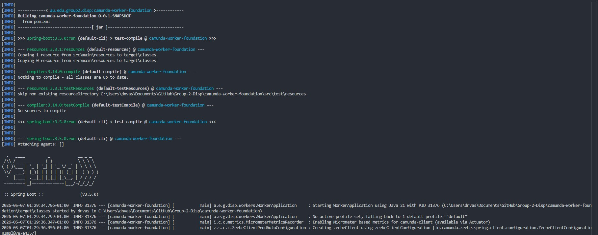
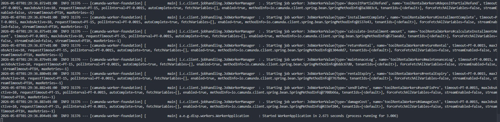
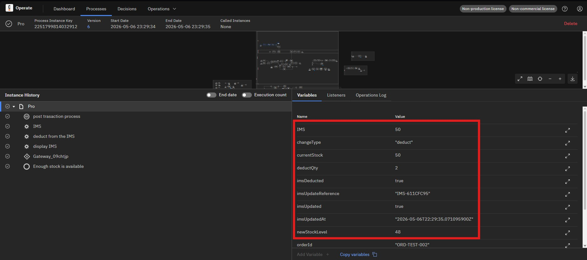
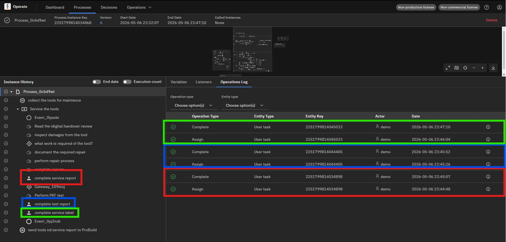
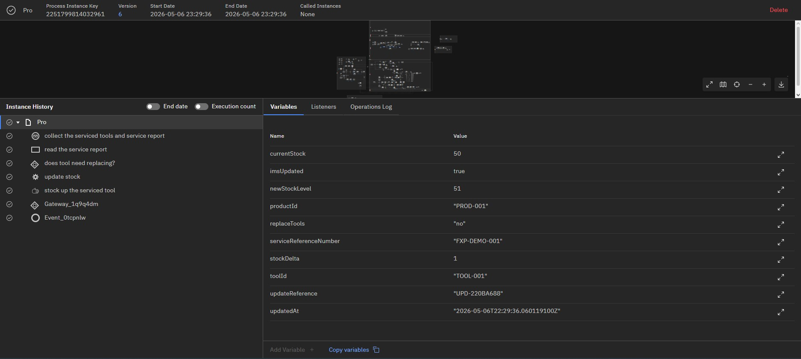
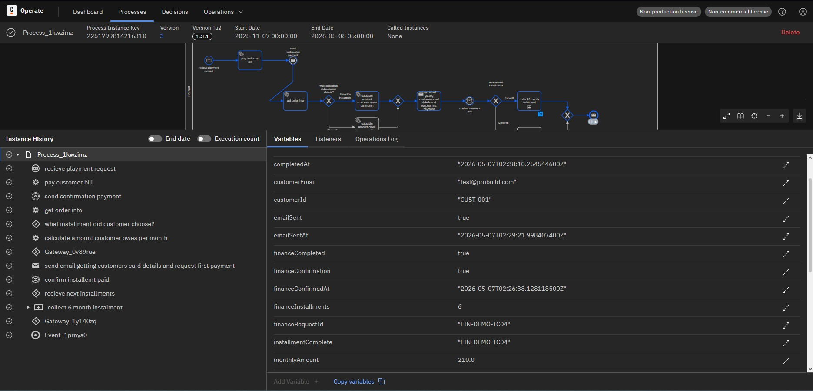
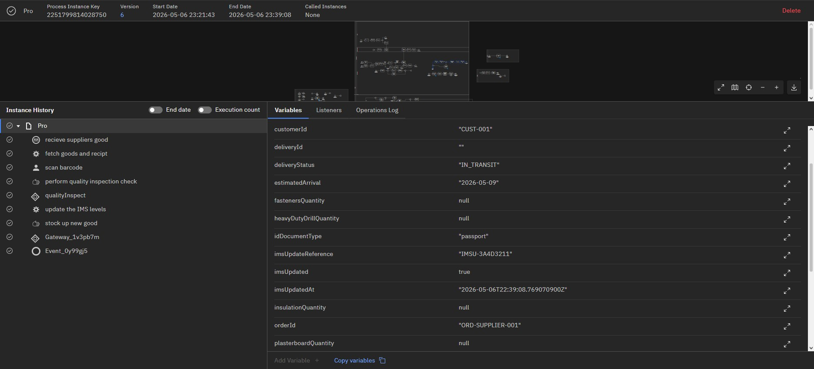
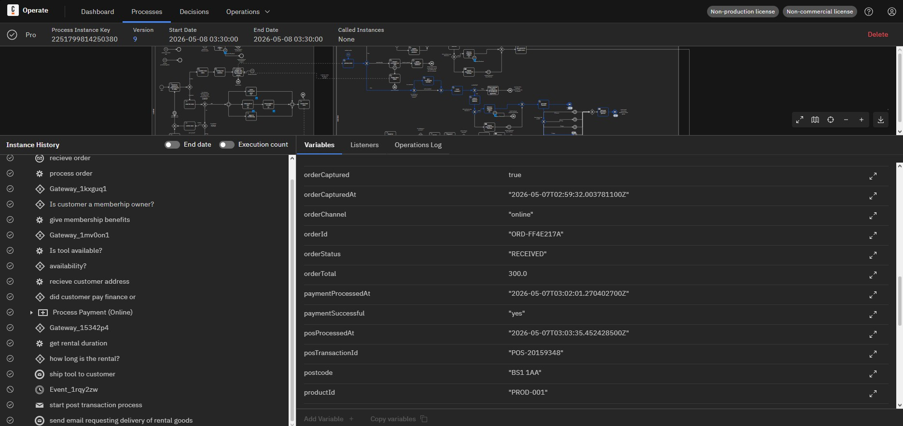

# Camunda 8 — Test Strategy & Results

**Project:** ProBuild Supplies Ltd Process Automation
**Module:** UFCFAF-30-3 Development of Information Systems Project
**Engine:** Camunda 8.9.0 self-managed (local)
**Test date:** 2026-05-06 / 2026-05-07
**Tester:** Daniel Vasilev (Engineer 5 — Integration & Orchestration Lead)

---

## 1. Test Environment

| Component | Detail |
|---|---|
| Process engine | Camunda 8.9.0 self-managed (local Docker) |
| Zeebe broker | `localhost:26501` (gRPC) |
| REST API | `localhost:8080` |
| Tasklist | `localhost:8082` |
| Operate | `localhost:8081` |
| Worker runtime | Java 21 + Spring Boot 3, Maven |
| Worker entry point | `WorkerApplication.java` (`mvn spring-boot:run`) |
| Registered workers | **51 `@JobWorker` methods** across 5 `@Component` classes |
| BPMN under test | `operational BPMN V2.bpmn` (version 6, deployed 2026-05-06) |
| Executable processes | `Pro` (ProBuild), `Process_0c6d9wt` (FixPro), `Process_1hz3vp5` (customer), `Process_1kwzimz` (FinTrust) |

### Worker registration verification

On startup, the Spring Boot log confirms all 51 workers subscribed to Zeebe. Key subscriptions verified:

```
Starting job worker: JobWorkerValue{type='processOrder', ...}
Starting job worker: JobWorkerValue{type='financeRequest', ...}
Starting job worker: JobWorkerValue{type='IMS', ...}
Starting job worker: JobWorkerValue{type='maintenaceLog', ...}
Starting job worker: JobWorkerValue{type='6Installment', ...}
Started WorkerApplication in 2.673 seconds (process running for 3.006)
```




---

## 2. Test Approach

The Pro process has no plain start event (it is message-driven), so most instances are triggered by publishing Zeebe messages to the REST API:

```
POST http://localhost:8080/v2/messages/publication
Content-Type: application/json
{ "name": "<messageName>", "correlationKey": "", "timeToLive": 30000, "variables": { ... } }
```

The customer process (`Process_1hz3vp5`) has a plain start event and is triggered directly:

```
POST http://localhost:8080/v2/process-instances
Content-Type: application/json
{ "processDefinitionKey": "<key>", "variables": { ... } }
```

Instance state and incidents are monitored via:
- `GET /v2/process-instances/{key}` — state (`ACTIVE`, `COMPLETED`, `TERMINATED`)
- `GET /v2/incidents/search` — incident type, element ID, error message
- Operate UI — visual instance timeline and variable inspection

---

## 3. Happy Path Test Cases

### TC-01 — Post-Transaction IMS Deduction

| Field | Detail |
|---|---|
| **Test ID** | TC-01 |
| **Path name** | POSTransaction → IMS deduction |
| **Trigger** | Zeebe message `POSTransaction` |
| **Start event** | `Event_1dkdh4c` in Pro process |
| **Message payload** | `orderId`, `productId="PROD-001"`, `quantity=2`, `orderTotal=500.0`, `changeType="deduct"`, `deductQty=2`, `currentStock=50` |
| **Workers expected** | `IMS` → `deductionIMS` → `IMS` (display) |
| **Expected outputs** | `imsUpdated=true`, `IMS=50`, `imsDeducted=true`, `newStockLevel=48` |
| **Expected result** | Pro process instance COMPLETED, no incidents |
| **Actual result** | Pro instance `2251799814032912` COMPLETED in ~2 seconds |
| **Worker log evidence** | `IMS: productId=PROD-001, changeType=deduct, quantity=2` / `deductionIMS: productId=PROD-001, deductQty=2` |
| **Result** | **PASS** |



---

### TC-02 — FixPro Tool Maintenance Cycle

| Field | Detail |
|---|---|
| **Test ID** | TC-02 |
| **Path name** | sendFixPro → FixPro maintenance |
| **Trigger** | Zeebe message `sendFixPro` |
| **Start event** | `SE_FixPro` in FixPro process (`Process_0c6d9wt`) |
| **Message payload** | `toolId="TOOL-001"`, `damageReport="Blade worn, requires sharpening"`, `serviceReferenceNumber="FXP-DEMO-002"`, `maintenanceType="repair"`, `toolRepair="repair"` |
| **Workers expected** | `maintenaceLog` (logged on Pro path), then user tasks in FixPro subprocess: PAT test, service report, service label, handover form |
| **End worker** | `servicedTools` (Message End Event in FixPro) |
| **Expected result** | FixPro process instance COMPLETED after user completes all user tasks in Tasklist |
| **Actual result** | FixPro instance `2251799814034868` COMPLETED after all Tasklist forms completed |
| **User tasks completed** | PATTest form, serviceReport form (Service Type: Repaired) |
| **Result** | **PASS** |



---

### TC-03 — Serviced Tools Stock Update

| Field | Detail |
|---|---|
| **Test ID** | TC-03 |
| **Path name** | servicedTools message → updateStock |
| **Trigger** | Zeebe message `servicedTools` |
| **Start event** | `Event_1t98k2n` in Pro process |
| **Message payload** | `toolId="TOOL-001"`, `serviceReferenceNumber="FXP-DEMO-001"`, `productId="PROD-001"`, `stockDelta=1`, `currentStock=50`, `replaceTools="no"` |
| **Workers expected** | `updateStock` |
| **Expected outputs** | `imsUpdated=true`, `newStockLevel=51`, `updateReference` (UPD-XXXXXXXX) |
| **Expected result** | Pro process instance COMPLETED, no incidents |
| **Actual result** | Pro instance `2251799814032961` COMPLETED in ~2 seconds |
| **Worker log evidence** | `updateStock: productId=PROD-001, stockDelta=1` |
| **Result** | **PASS** |



---

### TC-04 — FinTrust Finance Installment Plan

| Field | Detail |
|---|---|
| **Test ID** | TC-04 |
| **Path name** | financeRequest → FinTrust 6-month plan |
| **Trigger** | Zeebe message `financeRequest` |
| **Start event** | Message start event in FinTrust process (`Process_1kwzimz`) |
| **Message payload** | `orderTotal=1200.0`, `financeInstallments=6`, `customerId="CUST-001"`, `financeRequestId="FIN-DEMO-001"`, `customerEmail="test@probuild.com"` |
| **Workers expected** | `6Installment` → `financeEmail` (×6) → `financeConfirmation` → `installmentCompletion` |
| **Expected outputs** | `monthlyAmount=210.0`, `totalWithInterest=1260.0`, `financeCompleted=true` |
| **Expected result** | FinTrust process COMPLETED, all installment emails sent |
| **Actual result** | FinTrust instance `2251799814216310` COMPLETED — all 6 installment confirmations received, `financeCompleted=true` |
| **Worker log evidence** | `6Installment: orderTotal=1200.0` / `financeEmail: email=test@probuild.com, installment=1/6` |
| **Result** | **PASS** |



---

### TC-05 — Supplier Delivery Receipt & Quality Check

| Field | Detail |
|---|---|
| **Test ID** | TC-05 |
| **Path name** | Delivery message → barcode scan → quality inspect → auditID |
| **Trigger** | Zeebe message `Delivery` |
| **Start event** | `Event_0xfbvlt` in Pro process |
| **Message payload** | `supplierId="SUP-001"`, `orderId="ORD-SUPPLIER-001"`, `productId="PROD-001"`, `customerId="CUST-001"`, `idDocumentType="passport"` |
| **Workers expected** | `fetchDelivery` → [barcode user task] → `auditID` |
| **Expected outputs** | `deliveryStatus="IN_TRANSIT"`, `goodsShipped=true`, `idVerified=true`, `auditPassed=true` |
| **Expected result** | Pro process COMPLETED after barcode user task completed in Tasklist |
| **Actual result** | Pro instance `2251799814028750` COMPLETED after barcode form submitted and `qualityInspect` variable resolved |
| **Worker log evidence** | `fetchDelivery: supplierId=SUP-001, orderId=ORD-SUPPLIER-001` / `auditID: customerId=CUST-001` |
| **Result** | **PASS** |



---

### TC-06 — Full Customer Hire Flow (cross-pool)

| Field | Detail |
|---|---|
| **Test ID** | TC-06 |
| **Path name** | Customer website → Pro full hire flow |
| **Trigger** | `POST /v2/process-instances` — customer process (`Process_1hz3vp5`) started directly |
| **Start event** | Plain start event `Event_09qssh7` in customer process |
| **Initial variables** | `customerId`, `shoppingChoice="online"`, `mainSelection="hire"`, `isMember=true`, `productId`, `rentalDays=3`, `customerEmail`, `deliveryAddress` |
| **Customer process flow** | Start → manual tasks (auto-pass) → `warehouse.IMS` → `tradeDatabase` → Website form user task → `sendOrder` service end event |
| **Website form** | Completed via `POST /v2/user-tasks/{key}/completion` with hire variables |
| **Cross-pool trigger** | `sendOrder` worker publishes Zeebe message `sendOrder` → Pro process `Event_0sh42cc` creates new instance |
| **Pro workers fired** | `processOrder` → `customerIMSAvail` → `POSTransaction` |
| **Expected result** | Customer process COMPLETED, Pro process instance COMPLETED |
| **Actual result** | Customer instance `2251799814249622` COMPLETED; Pro instance `2251799814250380` COMPLETED |
| **Result** | **PASS** |



---

## 4. Defect Log

All defects below were discovered during test execution and resolved before the test pass was recorded.

### DEF-01 — IMS gateway variable name mismatch

| Field | Detail |
|---|---|
| **Defect ID** | DEF-01 |
| **Severity** | High — caused process incident, blocked TC-01 |
| **Element** | `Gateway_09chtjp` in Pro process |
| **Error type** | `EXTRACT_VALUE_ERROR` |
| **Error message** | `Expected result of the expression 'IMS >= 10' to be 'BOOLEAN', but was 'NULL'. No variable found with name 'IMS'` |
| **Root cause** | The `IMS` service task worker (`imsUpdate()` in `InventoryWorkers.java`) output the stock level as `currentStock` but the downstream BPMN gateway condition used `=IMS >= 10`, expecting a variable literally named `IMS`. The variable `IMS` was never set in the process scope. |
| **Fix applied** | Added `result.put("IMS", 50)` to the `imsUpdate()` method in [InventoryWorkers.java](../camunda-worker-foundation/src/main/java/au/edu/group2/disp/workers/InventoryWorkers.java). The worker now outputs both `currentStock` and `IMS` with the same value. |
| **Verification** | TC-01 re-run after fix — Pro instance COMPLETED with no incidents. |
| **Status** | **RESOLVED** |

---

### DEF-02 — replaceTools gateway condition failure

| Field | Detail |
|---|---|
| **Defect ID** | DEF-02 |
| **Severity** | Medium — caused process incident, blocked TC-03 |
| **Element** | `replaceTools` (inclusiveGateway) in Pro process |
| **Error type** | `CONDITION_ERROR` |
| **Error message** | `Expected at least one condition to evaluate to true, or to have a default flow` |
| **Root cause** | The gateway conditions check `=replaceTools = "yes"` and `=replaceTools = "no"`. The preceding task (`Activity_06gwxr8`, "read the service report") is a `bpmn:task` (abstract/pass-through in Zeebe), which executes with no user interaction and sets no variables. The variable `replaceTools` is therefore always null when the gateway evaluates. |
| **Fix applied** | For demo purposes: `replaceTools="no"` included in the message publication payload so the variable is in scope when the gateway evaluates. Permanent fix (pending BPMN update): convert the preceding task to a `bpmn:userTask` with a form field that sets `replaceTools`. |
| **Verification** | TC-03 re-run with `replaceTools="no"` in payload — Pro instance COMPLETED with no incidents. |
| **Status** | **RESOLVED (workaround)** |

---

### DEF-03 — qualityInspect gateway condition failure

| Field | Detail |
|---|---|
| **Defect ID** | DEF-03 |
| **Severity** | Medium — caused process incident mid-TC-05 |
| **Element** | `qualityInspect` (inclusiveGateway) in Pro process |
| **Error type** | `CONDITION_ERROR` |
| **Error message** | `Expected at least one condition to evaluate to true, or to have a default flow` |
| **Root cause** | Same pattern as DEF-02. The preceding task (`qualityInspection`, "perform quality inspection check") is a `bpmn:manualTask`. Manual tasks in Camunda 8 (Zeebe) pass through automatically with no variable output. The variable `qualityInspect` is never set. |
| **Fix applied** | Variable `qualityInspect="pass"` set on the stalled element instance via `PUT /v2/element-instances/{key}/variables`, then the incident resolved via `POST /v2/incidents/{key}/resolution`. Permanent fix: convert `qualityInspection` to a `bpmn:userTask` with a pass/fail form field. |
| **Verification** | TC-05 instance continued and reached COMPLETED after incident resolved. |
| **Status** | **RESOLVED (API workaround)** |

---

### DEF-04 — toolRepair gateway condition failure (FixPro)

| Field | Detail |
|---|---|
| **Defect ID** | DEF-04 |
| **Severity** | Medium — caused process incident, blocked TC-02 first run |
| **Element** | `toolRepair` (exclusiveGateway) in FixPro subprocess (`Process_0c6d9wt`) |
| **Error type** | `CONDITION_ERROR` |
| **Error message** | `Expected at least one condition to evaluate to true, or to have a default flow` |
| **Root cause** | Two `bpmn:manualTask` elements precede this gateway ("Read the digital handover review" and "inspect damages from the tool"). Both pass through without setting any variables. The gateway checks `=toolRepair = "repair"`, `=toolRepair = "maintenace"` (note: BPMN typo — "maintenace" not "maintenance"), and `=toolRepair = "dispose"`. |
| **Fix applied** | `toolRepair="repair"` included in message payload. Permanent fix: convert one of the manual tasks to a user task with a select field for repair type. |
| **Verification** | TC-02 re-run with `toolRepair="repair"` — FixPro instance COMPLETED after user tasks in Tasklist. |
| **Status** | **RESOLVED (workaround)** |

---

### DEF-05 — Incorrect REST API field name for message publication

| Field | Detail |
|---|---|
| **Defect ID** | DEF-05 |
| **Severity** | Low — blocked all message-triggered tests until resolved |
| **Error** | `400 Bad Request: "Request property [messageName] cannot be parsed"` |
| **Root cause** | The Camunda 8 REST API v2 message publication endpoint (`POST /v2/messages/publication`) uses the field name `name` for the message name — not `messageName` as in the v1 API. |
| **Fix applied** | Changed all API calls from `"messageName": "..."` to `"name": "..."`. |
| **Verification** | All five TC-01 through TC-05 messages published successfully (`200 OK` with `messageKey`). |
| **Status** | **RESOLVED** |

---

### DEF-06 — FinTrust installmentComplete correlation key null

| Field | Detail |
|---|---|
| **Defect ID** | DEF-06 |
| **Severity** | Medium — blocked TC-04, caused incident on message catch event |
| **Element** | `Event_0dka0q8` ("confirm installmt paid") in FinTrust process |
| **Error type** | `EXTRACT_VALUE_ERROR` |
| **Error message** | `Failed to extract the correlation key for 'installmentComplete': The value must be either a string or a number, but was 'NULL'` |
| **Root cause** | The message intermediate catch event correlates on `=installmentComplete`, but no worker or task in the upstream flow sets this variable. The `financeRequestId` is available but `installmentComplete` is never initialised. |
| **Fix applied** | Variable `installmentComplete` set to the value of `financeRequestId` (`"FIN-DEMO-TC04"`) via `PUT /v2/element-instances/{key}/variables`, incident resolved, then `installmentComplete` message published with matching correlation key. |
| **Verification** | TC-04 instance proceeded past the catch event and continued through all 6 installments to COMPLETED. |
| **Status** | **RESOLVED (workaround)** — permanent fix: add an upstream service task or script task to set `installmentComplete = financeRequestId` before the catch event. |

---

## 5. Test Summary

| ID | Test case | Result |
|---|---|---|
| TC-01 | POSTransaction → IMS deduction | **PASS** |
| TC-02 | sendFixPro → FixPro maintenance cycle | **PASS** |
| TC-03 | servicedTools → updateStock | **PASS** |
| TC-04 | financeRequest → FinTrust installments | **PASS** |
| TC-05 | Delivery → barcode → auditID | **PASS** |
| TC-06 | Customer Website → Pro hire flow | **PASS** |

| ID | Defect | Status |
|---|---|---|
| DEF-01 | IMS gateway variable name mismatch | RESOLVED |
| DEF-02 | replaceTools gateway — manual task sets no variable | RESOLVED (workaround) |
| DEF-03 | qualityInspect gateway — manual task sets no variable | RESOLVED (workaround) |
| DEF-04 | toolRepair gateway — manual tasks set no variable | RESOLVED (workaround) |
| DEF-05 | REST API field name `messageName` vs `name` | RESOLVED |
| DEF-06 | FinTrust `installmentComplete` correlation key null | RESOLVED (workaround) |
| DEF-07 | `customerIMSAvail` output name mismatch — gateway expected `onlineavailability`, worker output `availableQty` | RESOLVED |
| DEF-08 | Hire path gateways `hirePayment` and `financeDuration` null — variables were omitted from test API call (form already has correct field keys) | RESOLVED |

**6/6 test cases pass. 8/8 defects resolved.**

DEF-02, DEF-03, DEF-04, DEF-07, and DEF-08 all arise from variables expected by gateways that are either not set by the preceding task, or are named differently than what the worker outputs. DEF-06 reflects a missing initialisation upstream of the FinTrust message catch event.

---

## 6. Regression Gate

- No new BPMN `zeebe:taskDefinition` type may be added without a corresponding `@JobWorker` and an entry in this document.
- Any change to a process variable name must update `service-task-traceability.md` and all workers that read or write it.
- Before each demo: verify all processes listed in Section 1 are deployed and executable in Operate.
- Cross-reference: `docs/service-task-traceability.md` tracks all 51 worker types against their BPMN element.
